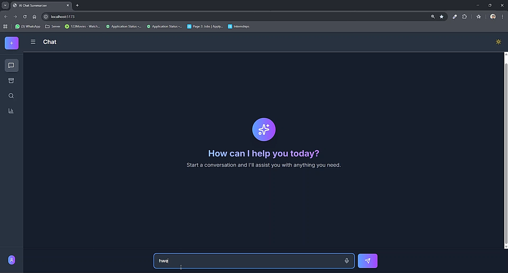
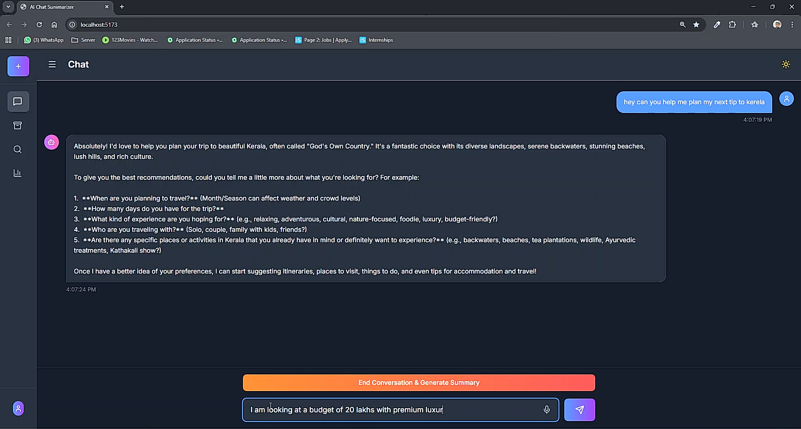
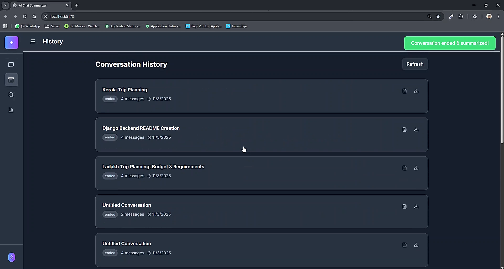
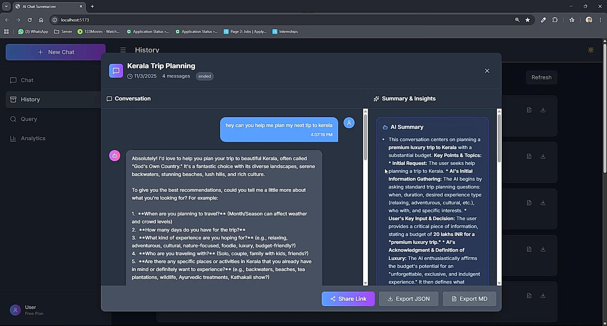
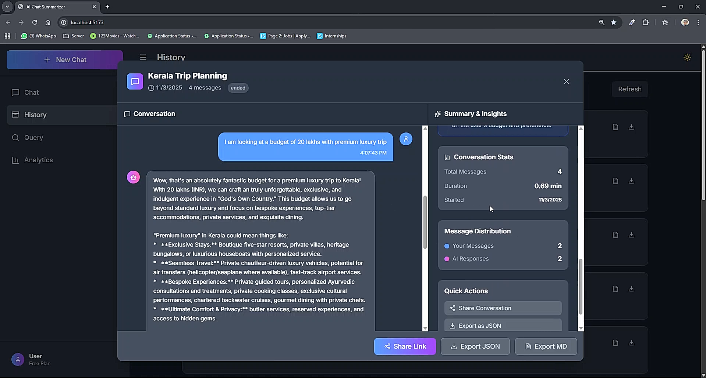
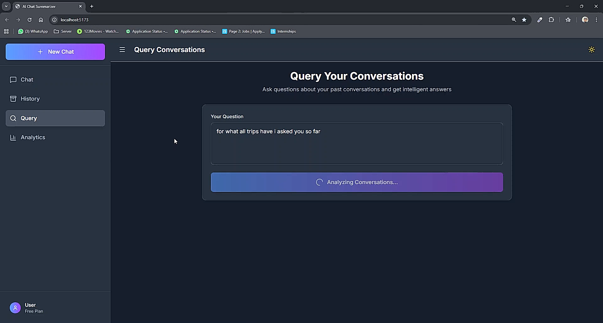
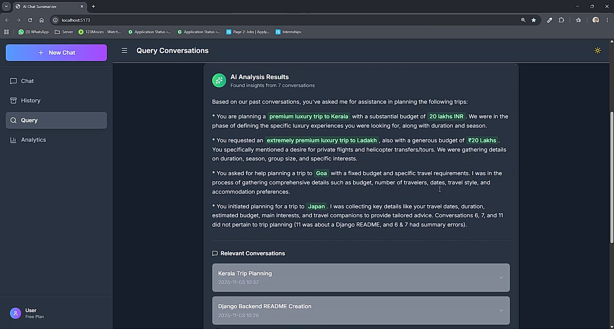
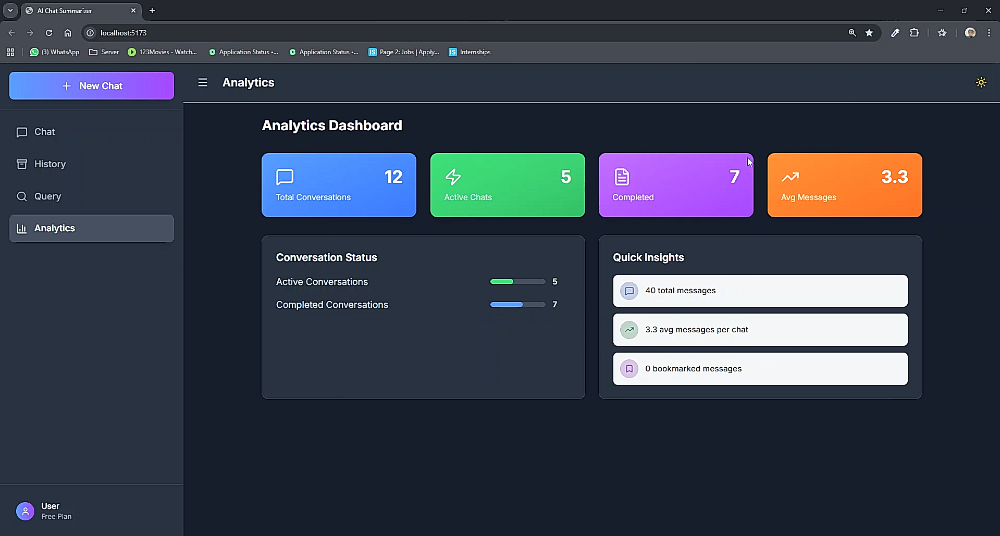

# 🌟 AI CHATBOT plus SUMMARISER

A web application with **Django REST Framework** as the backend and **React** as the frontend.  

---

## 🛠 Tech Stack

- **Backend:** Django, Django REST Framework, PostgreSQL  
- **Frontend:** React, Tailwind CSS 
---

## ⚡ Setup Instructions

### **1. Backend Setup (Django REST Framework)**

```
python -m venv venv
venv\Scripts\activate
pip install -r requirements.txt
```

```
python manage.py migrate
python manage.py runserver
```

The backend API will run at http://127.0.0.1:8000/.

### **2. Frontend Setup ( React )**

Navigate to frontend folder

`cd ../frontend`

Install dependencies

`npm install`

Start the frontend development server

`npm start`

The frontend will run at http://localhost:3000/.

## 📸 Screenshots
















